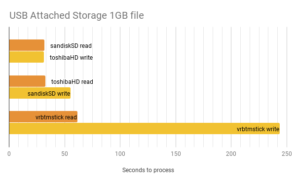
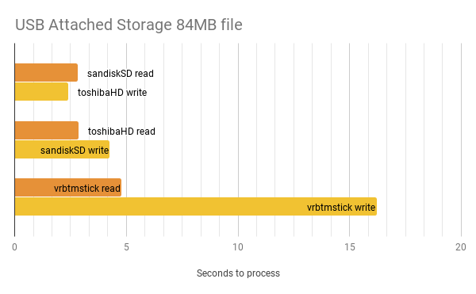
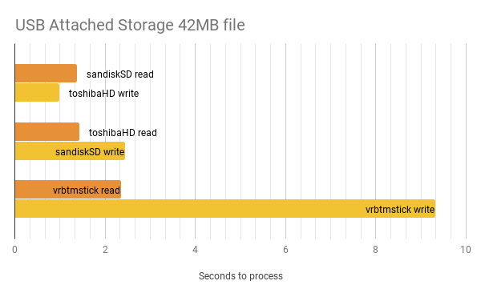

### Why
In effort to make maintenance, backups, and recovery a little more managable I chose to move the following directories to USB removable storage.  I use a rotation of 5 micoroSD cards so my concerns about wearing out the microSD cards were minimal.

- /var/log   
  - active file directory
  - "state" of the system
- /home/homeassistant/.homeassistant
  - Home Assistant database
  - YAMLs
  - All the "stuff" needed by HA
  
This set up allows me to swap the micorSD cards and boot up to a fuctioning Home Assitant instance that is current as of the shutdown/failure.

### The Plan

- Have my buddy at amazon send me a couble verbatim 16gb thumb drives
- Do those fancy mount what use the UUID of the disk so it doesn't matter what port the drive is plugged in to 
  -  ```ls -l /dev/disk/by-uuid/```
  - create mount points
    - real
    - temp
    - update /etc/fstab
  - shutdonw HA
  - ```sudo mount -a```
  - move data in /home/homeassistant/.homeassistant to temp mount point
  - ```sudo chown``` 
  - ```sudo chmod```
  - ```mounnt -a```
  - lots of ```ls -la```
  - reboot 
  
  
  The addtions to /etc/fstab look like this ```timeout=1``` continues boot after one second if drive not available
```
    ## this is the thumb drive
    UUID=beed2112-beed-2112-beed-2112beed2112 /var/log  ext4    defaults,noatime,nofail,x-systemd.device-timeout=1  
 0       1
    ##  usb fob with micro sd card 
    UUID=abacaba-beef-feed-2112-abacabacab /home/homeassistant/.homeassistant ext4    defaults,noatime,nofail,x-systemd.device-timeout=1   0  
```
### The first boot

SSH into the system for the first time
- ``` tail -f home/homeassistant/.homeassistant/home-assistant.log ```
- HA restarting
- wemo discovery happening
- **SQLite3 DB put into read only (do I even have still the error messages?)**
- Back off changes 
- Restart


### Learning time 

After a little time with the google I learned that SQLite3 was most likely unhappy because of the **_speed_** of the thumbdrives.  

In one of the discussions I ran across an example that used the ```dd`` command to get some drive speed numbers.


Results of transfer tests








